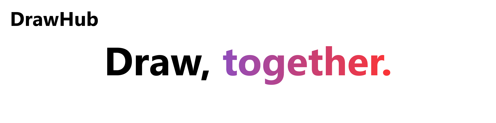
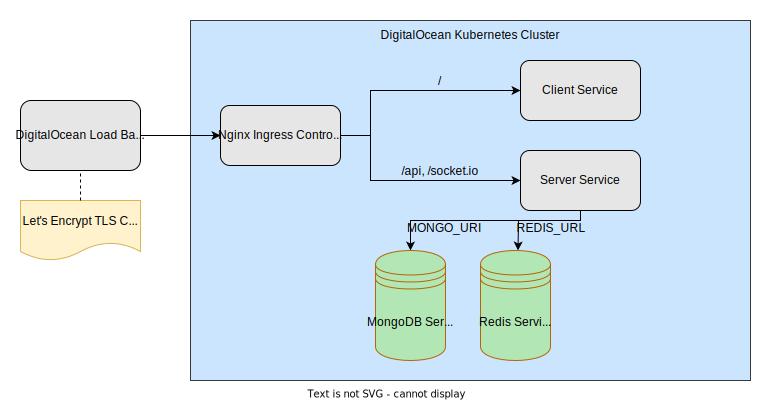

  

 

DrawHub is the easiest and fastest way to get your ideas onto a digital canvas. Work alone, or with others in realtime, to create and share digital masterpieces straight to the cloud. ✏️

## Core Features 

- [x] Sign in via Google using Auth0 and JWT Authorization

- [x] Draw (with custom pen widths and colors) onto a canvas with realtime updates with multiple users

- [x] Invite others, using email, to join the canvas session, through a unique shareable link

- [x] Create private canvases, hidden to other users
  - Invite other users to join the canvas session, but only specified in a list of allowed emails

- [x] "Stitch" (copy/fork) other public canvases to add on top of it, either public or private

- [x] Save the canvas as an image and auto-upload it to Google Drive

- [x] View other users' public canvases

- [x] Get notified through when they have been invited to a canvas or their canvas has been stitched

 

 

## Built with...

### Core Technology

- [Nx](https://nx.dev/) (Monorepo + CLI Tools)
- [React + TypeScript](https://reactjs.org/) (Client Application)
- [NestJS](https://nestjs.com/) (Server Application)
- [Apollo GraphQL](https://www.apollographql.com/) (Primary API)
- [Socket.io](https://socket.io/) (WebSockets)
- [Bull](https://github.com/OptimalBits/bull) (Queue Manager)
- [Nodemailer](https://nodemailer.com/about/) (Emails)
- [MongoDB](https://www.mongodb.com/) (Primary Datastore)
- [Redis](https://redis.io/) (Queue Datastore)

### External Services

- [Auth0](https://auth0.com/) (Authentication + Authorization)
- [AWS S3](https://aws.amazon.com/s3/) (Primary Blob Storage)
- [Google Drive API](https://developers.google.com/drive/api) (Personal Upload)
- [Twilio SendGrid](https://www.twilio.com/sendgrid/email-api) (Email API)

### Deployment

- [Docker](https://www.docker.com/) (Images)
- [GitHub Actions](https://github.com/features/actions) (CI/CD)
- [Kubernetes](https://kubernetes.io/) (Cluster)
- [DigitalOcean](https://www.digitalocean.com/) (Cloud Provider)
- [Nginx](https://nginx.org/en/) (Ingress + Static Server)
- [Let's Encrypt](https://letsencrypt.org/) (Certificate Authority)

#### Simplified Diagram

